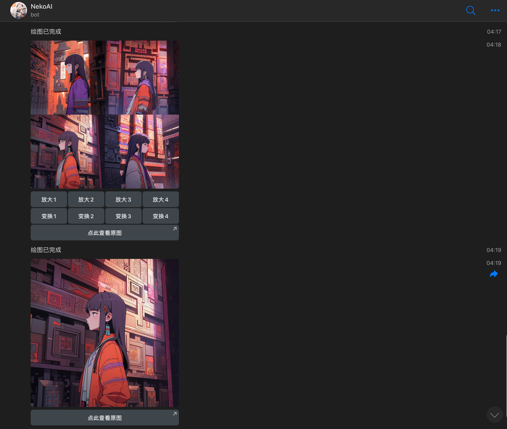

# 效果

# 配置文件

```toml
# bot token，从 BotFather 获取
bot-token = "your bot token"

# admin 用户名，用于管理
admin-username = ["YourUserName"]

# 调用 key， 从 https://nekoapi.com/ 获取
api-key = "sk-xxx"

# 新用户注册赠送积分
new-user-balance = 50

# 每日签到赠送积分
sign-gift-balance = 10

# 绘图所需积分
imagine-price = 10

# 您的系统访问令牌
access-token = ""

```

# 如何获取系统访问令牌
1. 访问 https://nekoapi.com/ 并登录
2. 点击设置->个人设置->通用设置->生成系统访问令牌
3. 将获得的令牌填入配置文件中